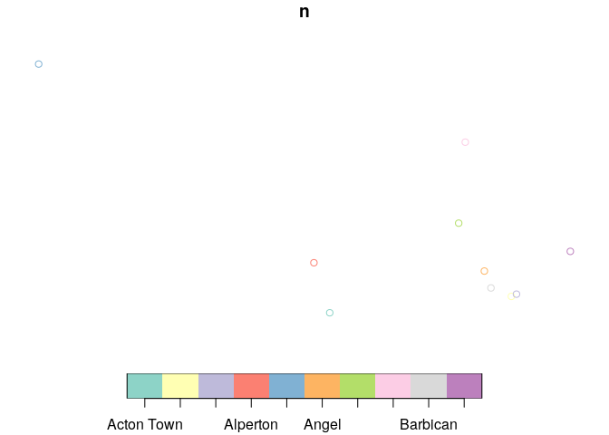
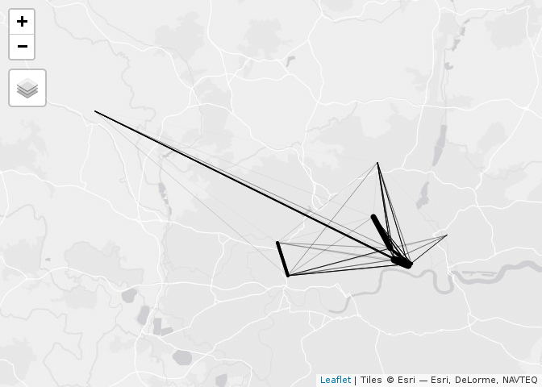

<!-- README.md is generated from README.Rmd. Please edit that file -->

# londonOD

<!-- badges: start -->

<!-- badges: end -->

The goal of londonOD is to showcase new OD data for London.

This is a work in progress repo to get started.

We’ll use these packages:

``` r
library(sf)
library(tmap)
library(dplyr)
library(stplanr)
```

# Data cleaning

First step: clean the
data.

``` r
u = "http://crowding.data.tfl.gov.uk/NUMBAT/2018/Friday/2018FRI_OD_Network.xlsx"
if(!file.exists("network.xlsx"))
download.file(u, destfile = "network.xlsx")
d = readxl::read_excel("network.xlsx", 2, skip = 2)
stations_sample = unique(d$`Origin Station Name`)[1:10]
stations_sample_lnd = paste(stations_sample, "london")
# stations_sample_geo = ggmap::geocode(stations_sample_lnd)
stations_sample_geo = stplanr::geo_code(stations_sample_lnd[1])
ssg = sapply(stations_sample_lnd, FUN = stplanr::geo_code)
ssgt = t(ssg)
ssgt
#>                                          [,1]     [,2]
#> Acton Town london                  -0.2801097 51.50280
#> Barbican london                    -0.0986832 51.52015
#> Aldgate london                     -0.0757186 51.51425
#> Aldgate East london                -0.0699691 51.51581
#> Stratford International DLR london -0.0093590 51.54571
#> Alperton london                    -0.2979241 51.53777
#> Amersham london                    -0.6076920 51.67668
#> Angel london                       -0.1061056 51.53195
#> Archway london                     -0.1349977 51.56544
#> Arnos Grove london                 -0.1275798 51.62209
ssgt_df = tibble::tibble(n = stations_sample, x = ssgt[, 1], y = ssgt[, 2])
names(ssgt_df) 
#> [1] "n" "x" "y"
d_sample = d[d$`Origin Station Name` %in% stations_sample &
                 d$`Destination Station Name` %in% stations_sample, ]
ssgt_sf = sf::st_as_sf(ssgt_df, coords = c("x", "y"), crs = 4326)
plot(ssgt_sf)
```

<!-- -->

``` r
d_sample_renamed = d_sample %>% select(`Origin Station Name`, `Destination Station Name`, everything())
```

# Convert to desire lines

``` r
desire_lines = stplanr::od2line(flow = d_sample_renamed, ssgt_sf)
tmap_mode("view")
#> tmap mode set to interactive viewing
tm_shape(desire_lines) +
  tm_lines(lwd = "Total", scale = 9)
#> Legend for line widths not available in view mode.
```

<!-- -->
